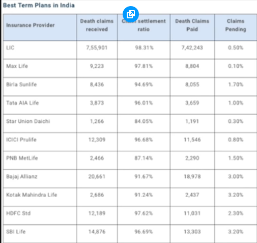
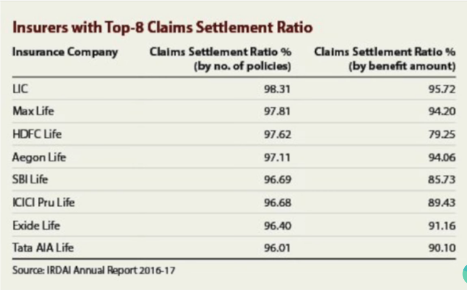

# Claim Settlement Ratio

- Claim Settlement Ratio (by number of claims settled)

    Claim Settlement ratio or percentage is the number of people who were paid by the company, for every 100 people to claim.

    

- You have to check the amount the company is actually paying. Some companies pay the customers with lower claim, but don’t pay those with higher claim. For example, if 100 people have bought an insurance of ₹1 lac each, the company will pay them when they claim, as all of their claims combined have a value of 1 crore. Whereas if a person has bought an insurance of 2 or 5 crore, these companies don’t pay them. In this way, they keep their claim settlement ratio high and also save a lot of money using different excuses to not pay their big customers.

  Comparison of claim settlement ratio by number of policies and by amount for different companies
  

  - As you can see here, LIC and Max Life, are still on top with highest amount of claims settled.
  - HDFC which was among the top companies in terms of number of policies, rank very low in terms of amount settled. So keep this in mind, and check an updated list of amount of claims settled before buying insurances.

⚠ Check the latest claim settlement ratio [here](https://drive.google.com/file/d/1MjJOw5NVZaOrh6Dc0_fP682L2HD7hZYX/view?usp=sharing) when buying.

💡 In the data provided by IRDA for claim settlement ratio, its not shown whether these claims settled are for term plans, ULIPs or endowment plan etc.
