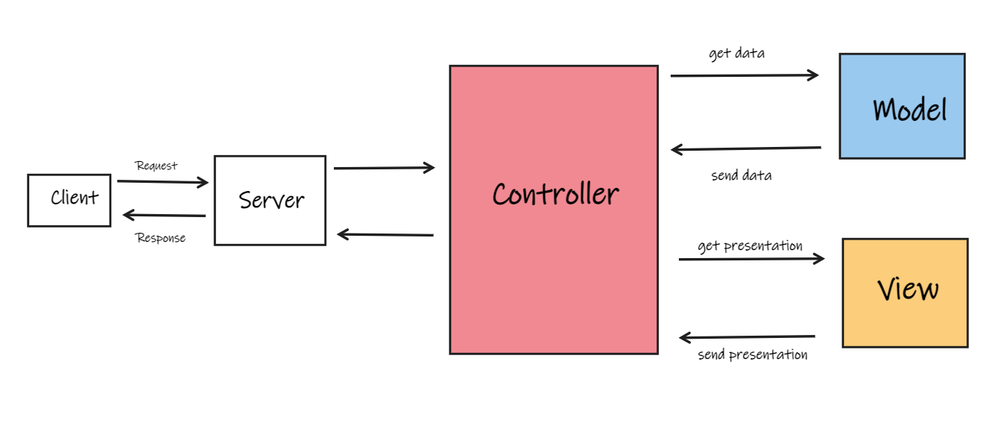

# Model-View-Controller (MVC)

MVC is an [[Architecture Pattern]] that emphasises the seperation of business logic, the data and the User interface.

It divides the application into three tiers:

- [[Model]]
- [[View]]
- [[Controller]]

- Model and View never interact with each other
- Any such interactions are done through controller

## MVC Flow

## References
