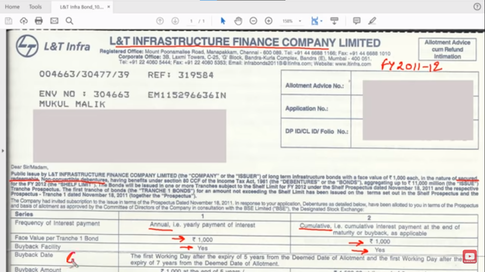

# Ways to Invest in Fixed Income Securities (Bonds and Debentures)

## Method 1: Indirect

- [[Debt Funds]]
- Advantage: Convenience
- Disadvantage: Fees (1-2%)

## Method 2: Direct

How to buy:

- [[Corporate Bonds]]
  - Trading and Demat account
  - Through commercial banks
  - Company website or branch
- [[Government Bonds]]
  - [[Government Bonds are Illiquid Assets]] so you can't buy them directly.
- [[Tax-saving Bonds]]
  - Visit Bank/financial institutions registered with the corporation

## Things to look for in a bond certificate

[//begin]: # "Autogenerated link references for markdown compatibility"
[Debt Funds]: <Debt Funds.md> "Debt Funds"
[Corporate Bonds]: <Corporate Bonds.md> "Corporate Bonds"
[Government Bonds]: <Government Bonds.md> "Government Bonds"
[Government Bonds are Illiquid Assets]: <Government Bonds are Illiquid Assets.md> "Government Bonds are Illiquid Assets"
[Tax-saving Bonds]: <Tax-saving Bonds.md> "Tax-saving Bonds"
[//end]: # "Autogenerated link references"