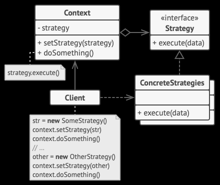

# Strategy Pattern

It is a [[Behavioural Design Pattern]].

## Goal

Giving different variation of certain behavioural capability to a [[same-same-but-different classes]] where the classes are related close-enough so as to be inheriting from a single class.

## Solution

The first straightforward solution which comes to mind is to create a method in the parent class and redefine the specific behavior in child classes by [[method overriding]].

However, this would lead to [[dependency]] of the child classes on the parent class. Also, there are many [[Disadvantages of Inheritance]] too.
In many cases, its wise to choose or at least consider using [[Composition over Inheritance]].

Strategy Pattern provides an elegant solution to this.

## Elaboration

We'll call the parent class 'Context' and the subclasses 'clients'.

### Strategy interface and Concrete strategies

Strategy Pattern uses an 'Strategy' interface which is common interface to different 'concrete strategy' classes which implement different variants of a certain behavior (which we want to give to the client classes).

### Context

The Context contains an object of the Strategy interface - so this object can be polymorphically changed to behave as any of the concrete strategies.

Context also has a setter to set the concrete strategy at runtime.

### Client

The client can thus change the behavior as many times at it wants through the setter and when the method to execute the said behavior is called - it will result in whatever behavior the client wanted to have.

## Example

Consider three classes, Animal, Dog and Bird. Animal is the parent class for both Dog and Bird and we want to give flying behavior to these subclasses.

So again, we could inherit a common `fly()` method and override it in Dog but that's not good code. We could also implement a fly method everytime we want a class, like bird, to have a flying capability. But that voilates the [[DRY]] principle.

Instead, we create another interface, say `Flys` which has a `fly()` method. This method can be implemented by different concrete classes - in this case - `ItFlys` and `CantFly`. Now, we add an object of `Flys` type to the `Animal` class. This object can be set by its subclasses through a `setFlyingAbility()` method. The `Animal` class will also have a `tryToFly()` method which will call the `fly()` method of the strategy object.

In this case, we set the flying ability for `Dog` and `Bird` in their respective constructors. For `Dog`, we pass an object of `CantFly` type to the `setFlyingAbility()` method and for `Bird`, we pass an object of `ItFlys` type.

Now, whenever the `tryToFly()` method is called from an object of `Dog` or `Bird`, it will behave in the intended manner as specified in the constructors of those classes.

## References

- Easy to understand example - [Strategy Design Pattern - Derek Banas](https://www.youtube.com/watch?v=-NCgRD9-C6o&ab_channel=DerekBanas)
- [Strategy](https://refactoring.guru/design-patterns/strategy)
